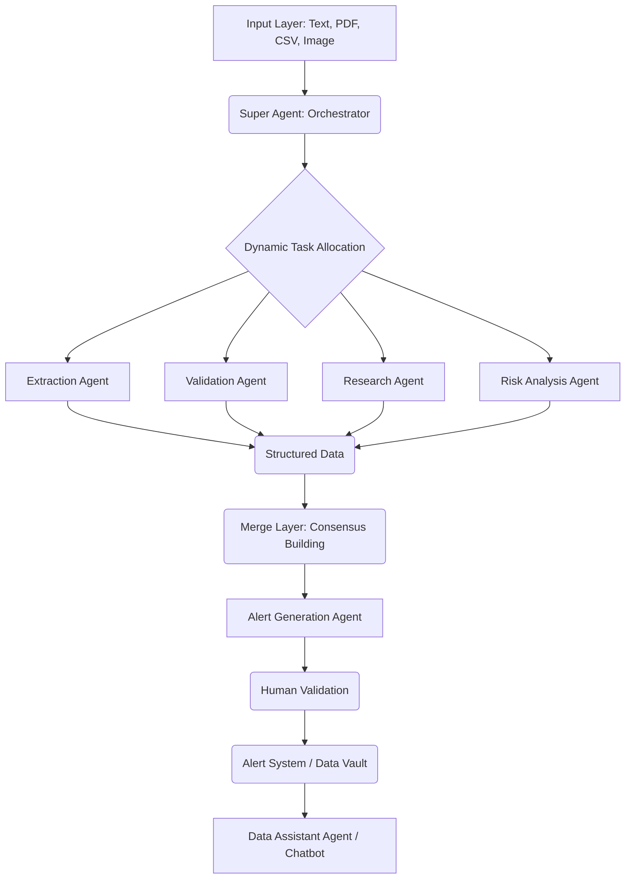

# Empowered Care: AI-Powered Disease Surveillance

 <!-- Placeholder for a logo, replace with actual path -->

**Empowered Care** is a cutting-edge, multi-agent AI system designed for rapid disease outbreak detection and medical document processing. Developed for the **Global Health Innovation Hackathon 2026 Addis Ababa Hub**, this project aims to revolutionize epidemiological surveillance by transforming unstructured data into actionable intelligence in real-time.

Leveraging advanced AI models, dynamic agent orchestration, and a user-friendly interface, Empowered Care provides public health officials with a powerful tool to monitor, analyze, and respond to potential health threats with unprecedented speed and accuracy.

## ✨ Features

*   **Multi-Channel Data Ingestion:** Process raw text, PDF documents, CSV files, and images (JPG, PNG) containing outbreak reports or medical records.
*   **Dynamic Multi-Agent AI Pipeline:** A hierarchical system of specialized AI agents (Extraction, Validation, Research, Risk Analysis, Alert Generation) working in concert to process and analyze data.
*   **Intelligent Data Extraction:** AI-powered extraction of key epidemiological entities (location, symptoms, cases, dates) from messy, unstructured reports.
*   **Contextual Intelligence:** Automated web research (Crawl4AI) to gather real-time environmental and security context for identified outbreak locations.
*   **Multi-Perspective Risk Analysis:** Specialized sub-agents analyze risk from clinical, statistical, historical, and environmental viewpoints, with a "Merge Layer" for consensus building.
*   **Automated Alert Generation:** Generates clear, actionable public health alerts with recommendations and prevention strategies.
*   **Human-in-the-Loop Validation:** Critical alerts are flagged for human review and approval before dissemination.
*   **Conversational AI Chatbot:** A multi-agent chatbot (`ChatSupervisor`) for natural language querying of outbreak data with session memory.
*   **Comprehensive Dashboard & Data Vault:** Real-time visualization of outbreak summaries, trends, and a historical archive of all processed intelligence.
*   **Medical Record Digitization:** Utilizes YOLO-based layout detection and Gemini Vision for high-accuracy extraction from scanned clinical forms.
*   **Role-Based Access Control:** Secure JWT authentication with roles for Admin, Viewer/Worker, and Data Entry.

## 🚀 Project Architecture & Design Patterns

Empowered Care employs a **Dynamic Hierarchical Multi-Agent System** as its core architectural pattern, following a "Supervisor-Worker" model.

### 🧠 Agent Orchestration (The Super Agent)

The `SuperAgent` acts as the central orchestrator, dynamically spawning and coordinating specialized sub-agents based on the complexity, volume, and urgency of incoming data. This approach ensures:

*   **Scalability:** Parallel processing of multiple reports or complex documents.
*   **Accuracy:** Each sub-agent focuses on a specific task, leading to higher precision.
*   **Robustness:** The system can adapt to diverse data types and scenarios.
*   **Explainability:** The "Merge Layer" provides a transparent consensus mechanism.



### 💡 Key Design Patterns

*   **Multi-Agent System:** The entire system is built around autonomous, collaborative agents.
*   **Pipeline Pattern:** Data flows through a series of processing stages (Extraction -> Validation -> Research -> Risk Analysis -> Alert Generation).
*   **Strategy Pattern:** The `RiskAnalysisAgent` uses different "perspectives" (symptoms, statistical, historical, environmental) as strategies to evaluate risk.
*   **Observer Pattern:** (Implicit) The `DataAssistantAgent` monitors and stores processed reports, making them available for querying and historical analysis.
*   **Lazy Loading:** Heavy services like the OCR engine are loaded only when needed to optimize startup performance.
*   **Command Pattern:** (Implicit) Manual and scheduled analysis triggers act as commands.

## 💻 Technology Stack

**Backend:**

*   **Language:** Python 3.12
*   **Web Framework:** FastAPI
*   **ASGI Server:** Uvicorn
*   **AI/ML:** Google Gemini 1.5 (Pro/Flash), YOLOv10 (Layout Detection), PaddleOCR (Fallback OCR)
*   **Web Scraping:** Crawl4AI (Async Playwright-based)
*   **Task Scheduling:** APScheduler
*   **Authentication:** PyJWT, Passlib
*   **Data Validation:** Pydantic
*   **PDF Processing:** `pdf2image`
*   **Image Processing:** OpenCV (`cv2`), PIL (`Pillow`)
*   **Data Storage:** JSON files (for simplicity in hackathon context, easily extendable to PostgreSQL/MongoDB)

**Frontend:**

*   **Framework:** React 18
*   **Language:** TypeScript
*   **Build Tool:** Vite
*   **Styling:** Tailwind CSS, Shadcn UI
*   **State Management:** Zustand
*   **Routing:** React Router DOM
*   **Data Visualization:** Recharts
*   **Animations:** Framer Motion
*   **API Client:** Axios (inferred)

## ⚙️ Setup and Installation

### Prerequisites

*   Python 3.12
*   Node.js (LTS) & npm/yarn/bun (for frontend)
*   `pdftoppm` (part of `poppler-utils` on Linux, `poppler` on macOS via Homebrew) for PDF processing.
    *   **Ubuntu/Debian:** `sudo apt-get update && sudo apt-get install poppler-utils`
    *   **macOS:** `brew install poppler`
*   A Google Gemini API Key (set as `GEMINI_API_KEY` in your `.env` file).

### Backend Setup

1.  **Clone the repository:**
    ```bash
    git clone https://github.com/your-org/empowered-care.git
    cd empowered-care
    ```
2.  **Create a virtual environment and activate it:**
    ```bash
    python3.12 -m venv .venv
    source .venv/bin/activate
    ```
3.  **Install backend dependencies:**
    ```bash
    pip install -r requirements.txt
    ```
4.  **Configure environment variables:**
    Create a `.env` file in the root directory based on `.env.example`.
    ```
    # .env
    GEMINI_API_KEY="YOUR_GEMINI_API_KEY"
    SECRET_KEY="a_very_secret_key_for_jwt_signing"
    SMTP_HOST="smtp.gmail.com"
    SMTP_PORT="587"
    SMTP_USER="your_email@example.com"
    SMTP_PASSWORD="your_email_app_password"
    SMTP_FROM="your_email@example.com"
    FRONTEND_URL="http://localhost:5173" # Or your deployed frontend URL
    ```
    **Note:** For `SMTP_USER` and `SMTP_PASSWORD`, if using Gmail, you'll need to generate an App Password. If you don't configure SMTP, email functionalities will be logged to console.

5.  **Create a default admin user:**
    This script will create an admin user with email `masri_dev@aegis.com` and password `AegisDeveloper2026!`.
    ```bash
    python create_admin.py
    ```
    You can change these credentials in `create_admin.py` if needed.

6.  **Run the FastAPI backend:**
    ```bash
    uvicorn main:app --host 0.0.0.0 --port 8000 --reload
    ```
    The backend will be accessible at `http://localhost:8000`.

### Frontend Setup

1.  **Navigate to the frontend directory:**
    ```bash
    cd frontend
    ```
2.  **Install frontend dependencies:**
    ```bash
    npm install # or yarn install or bun install
    ```
3.  **Run the React development server:**
    ```bash
    npm run dev # or yarn dev or bun dev
    ```
    The frontend will typically be accessible at `http://localhost:5173`.

## 🏃 How to Run and Use

1.  **Start Backend:** Ensure the FastAPI backend is running (`uvicorn main:app --host 0.0.0.0 --port 8000 --reload`).
2.  **Start Frontend:** Ensure the React development server is running (`npm run dev` in the `frontend` directory).
3.  **Access the Application:** Open your browser to `http://localhost:5173`.
4.  **Login:** Use the admin credentials created earlier (`masri_dev@aegis.com` / `AegisDeveloper2026!`) to log in.
5.  **Explore:**
    *   **Process Report:** Submit text or files (PDF, CSV, Image) to see the multi-agent pipeline in action.
    *   **Dashboard:** View real-time metrics, charts, and the Ethiopia map with outbreak hotspots.
    *   **Query Data:** Interact with the multi-agent chatbot to ask questions about the ingested data.
    *   **Alerts:** Review and validate high-risk alerts.
    *   **Data Vault:** Browse the historical archive of all processed intelligence.
    *   **Admin Panel:** Manage users and schedule background analysis jobs.
    *   **Data Entry:** Manually input patient records or upload medical files.

## 🤝 Contributing

We welcome contributions to Empowered Care! This project was built for the Global Health Innovation Hackathon 2026 Addis Ababa Hub, and we encourage community involvement to enhance its capabilities.

### Getting Started

1.  **Fork the repository.**
2.  **Clone your forked repository:**
    ```bash
    git clone https://github.com/your-username/empowered-care.git
    cd empowered-care
    ```
3.  **Set up your development environment** (see "Setup and Installation" above).
4.  **Create a new branch** for your feature or bug fix:
    ```bash
    git checkout -b feature/your-feature-name
    ```
5.  **Make your changes.**
6.  **Test your changes** thoroughly.
7.  **Commit your changes** with a clear and descriptive commit message.
8.  **Push your branch** to your forked repository.
9.  **Open a Pull Request** to the `main` branch of the original repository, describing your changes and their benefits.

### Contribution Guidelines

*   **Code Style:** Adhere to existing code styles (e.g., Black for Python, Prettier for TypeScript/React).
*   **Documentation:** Update relevant documentation (e.g., `API_SPECIFICATION.md`, `BUSINESS_LOGIC.md`, `SYSTEM_DESIGN_REVIEW.md`, or this `README.md`) for any new features or significant changes.
*   **Testing:** Add unit or integration tests for new functionality.
*   **Issue Tracking:** If you're addressing an existing issue, reference it in your commit message and pull request.
*   **Feature Requests:** Feel free to open an issue to suggest new features or improvements.

## 📄 License

This project is licensed under the MIT License - see the [LICENSE](LICENSE) file for details. <!-- Assuming an MIT license, create a LICENSE file if it doesn't exist -->

## 🏆 Global Health Innovation Hackathon 2026 Addis Ababa Hub

Empowered Care was proudly developed as a submission for the Global Health Innovation Hackathon 2026, hosted at the Addis Ababa Hub. Our goal was to demonstrate the transformative potential of AI in public health, enabling faster, more accurate responses to disease outbreaks in resource-constrained environments.

---

**Empowered Care - Transforming Data into Life-Saving Decisions.**
